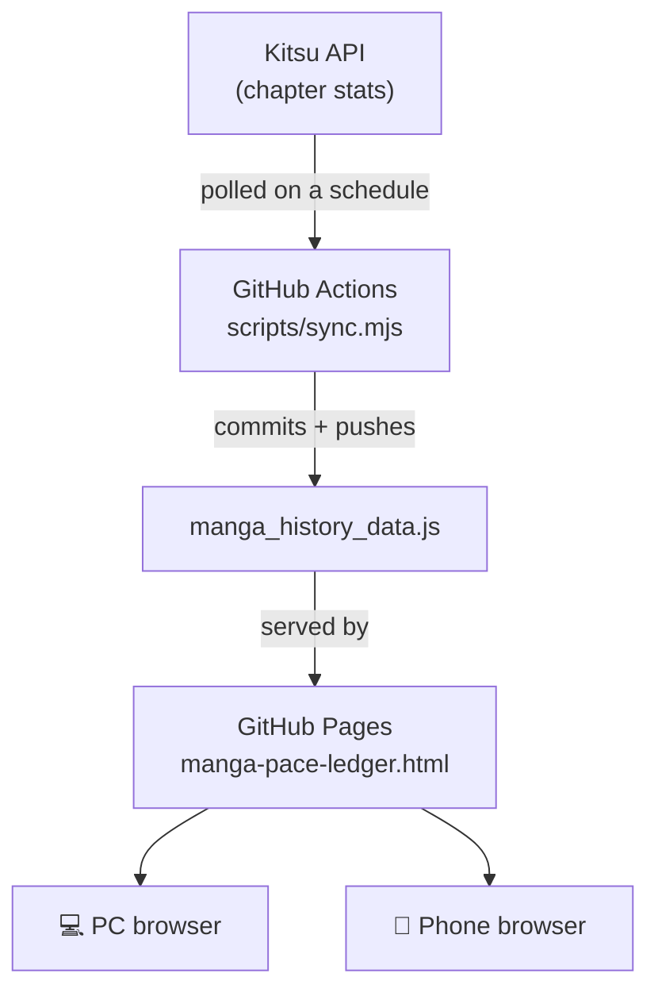

[README.md](https://github.com/user-attachments/files/29651667/README.md)
# 📖 Manga Pace Ledger

A self-updating dashboard that tracks manga chapters read (via [Kitsu](https://kitsu.io)), synced automatically in the cloud and viewable from any device — no PC required to be on.

**[→ View the live tracker](https://iky0ff.github.io/manga-pace-ledger/manga-pace-ledger.html)**

---

## Table of contents

- [Introduction](#introduction)
- [How it works](#how-it-works)
- [Repo structure](#repo-structure)
- [The sync logic](#the-sync-logic)
- [⚠️ Warnings & things to know](#️-warnings--things-to-know)
- [Setup](#setup)
  - [Option A — GitHub Actions only](#option-a--github-actions-only-simplest)
  - [Option B — GitHub Actions + an external cron pinger](#option-b--github-actions--an-external-cron-pinger-more-frequent-updates)
- [Pointing it at your own Kitsu account](#pointing-it-at-your-own-kitsu-account)
- [Customizing](#customizing)
- [More / notes](#more--notes)

---

## Introduction

This project turns a Kitsu reading profile into a small, self-hosted analytics dashboard: streaks, pace, goals, and charts, rebuilt automatically every time your chapter count changes. There's no backend to run and no server to maintain — GitHub hosts the page and GitHub Actions does the polling, so the tracker keeps itself current even if your own computer is off.

It was ported from a Windows Task Scheduler + VBS script (`fetch_manga_stats.vbs`, still included) into a small Node script (`scripts/sync.mjs`) that runs on GitHub's infrastructure instead of a personal machine.

---

## How it works

A scheduled GitHub Actions workflow polls the Kitsu API, compares the result to the last recorded chapter count, and commits an update to `manga_history_data.js` if anything changed. GitHub Pages serves the dashboard straight from the repo, so opening the same URL on a laptop or a phone always shows current data.

---

## Repo structure

| Path | Purpose |
|---|---|
| `manga-pace-ledger.html` | The dashboard — charts, streaks, goals, pace stats. Reads `manga_history_data.js` on load. |
| `manga_history_data.js` | The data file. An array of `{ date1, date2, chapters }` entries; overwritten in place by the sync. |
| `scripts/sync.mjs` | Node script that fetches Kitsu, parses the chapter count, and appends/updates an entry. |
| `.github/workflows/sync.yml` | Scheduled workflow that runs `sync.mjs` and commits the result. |
| `manga_history_data.bak` | Rolling backup — last version of the data file before the most recent write. |
| `manga_history_data_YYYYMMDD.bak.js` | One dated backup per day, refreshed on same-day reruns. |
| `sync_errors.log` | Timestamped log of failed fetches, parse errors, or skipped anomalies. Empty/absent when everything's healthy. |
| `fetch_manga_stats.vbs` | Original Windows script this was ported from. Kept as an optional local fallback — not required for the automated flow. |
| `favicon.ico`, `favicon-*.png` | Site favicon (browser tab / home-screen icon). |

---

## The sync logic

Each run:

1. Fetches `https://kitsu.io/api/edge/users/<KITSU_USER_ID>/stats` with a cache-busting query param, retrying up to **3 times** on failure.
2. Locates the `manga-amount-consumed` stat and extracts its `units` value.
3. Compares it to the last recorded chapter count:
   - **Same value** → just refreshes the "last checked" timestamp on the final entry.
   - **Higher value, normal jump** → backs up the data file, then appends a new entry.
   - **Jump of 500+ chapters** (configurable) → treated as a probable bad API response, not a real reading binge. Logged as an anomaly and **skipped** rather than written.
4. Commits and pushes only if the file actually changed — no empty commit spam.

---

## ⚠️ Warnings & things to know

- **This is hardcoded to one Kitsu account by default.** See [Pointing it at your own Kitsu account](#pointing-it-at-your-own-kitsu-account) below — you must update the user ID in two places before forking, or you'll be tracking someone else's reading progress.
- **GitHub Actions' own schedule is not exact.** GitHub explicitly does not guarantee cron jobs run on time — during high load, a scheduled run can be delayed anywhere from a couple of minutes to much longer. If you need tighter timing, use [Option B](#option-b--github-actions--an-external-cron-pinger-more-frequent-updates) below.
- **Very short intervals aren't reliable either way.** GitHub won't run scheduled workflows more often than about every 5 minutes, and pushing much below that (via an external pinger or otherwise) increases the risk of overlapping/delayed runs. `sync.yml` already sets `concurrency` so overlapping runs queue instead of racing each other, but there's no reason to poll faster than your reading pace changes.
- **Never commit a token to the repo.** Whether you use GitHub's built-in scheduler or an external cron service, any Personal Access Token (PAT) belongs only in that external service's own secret/credential storage — never in a workflow file, a commit, or anywhere public. If you ever paste a token into a screenshot, chat, or issue by mistake, treat it as compromised and revoke it immediately from **GitHub → Settings → Developer settings → Personal access tokens**.
- **Scope tokens minimally.** A PAT used only to trigger this workflow needs at most `repo` (classic) or `Actions: Read and write` + `Contents: Read and write` (fine-grained) — it doesn't need full account access.
- **Public repo required for the free tier.** GitHub Pages and unlimited Actions minutes on the free plan require a public repository. Don't put anything you want private in this repo.

---

## Setup

There are two ways to run the sync. Both use the exact same workflow and script — the only difference is *what triggers it*.

### Option A — GitHub Actions only (simplest)

GitHub runs the workflow itself on the schedule defined in `.github/workflows/sync.yml`. No external service, no extra credentials to manage.

1. Push this repo to GitHub (public, so Pages + Actions minutes are free).
2. **Settings → Pages** → Source: `main` branch, `/ (root)` → Save. This gives you the public dashboard URL.
3. **Settings → Actions → General → Workflow permissions** → set to **Read and write permissions**, so the workflow is allowed to push commits.
4. **Actions tab → Sync Kitsu Manga Stats → Run workflow** to trigger a manual test run and confirm it commits successfully.
5. Sit back — it runs automatically from then on, on the cron schedule already defined in `sync.yml`.

This is enough for most people. Skip straight to [Pointing it at your own Kitsu account](#pointing-it-at-your-own-kitsu-account).

### Option B — GitHub Actions + an external cron pinger (more frequent updates)

Because GitHub's own scheduler can lag under load, you can instead have a third-party cron service call GitHub's API to trigger the workflow (`workflow_dispatch`) on its own schedule — independent of GitHub's queue. This is purely optional and only worth doing if you want tighter, more predictable timing. Any cron-as-a-service tool that can send an HTTP request works (e.g. [cron-job.org](https://cron-job.org)); the steps below use it as an example.

1. **Create a fine-scoped GitHub token** (don't reuse a broad personal token):
   - Go to **GitHub → Settings → Developer settings → Personal access tokens → Fine-grained tokens → Generate new token**.
   - Restrict it to **this repository only**.
   - Under permissions, grant **Contents: Read and write** and **Actions: Read and write** — nothing else.
   - Set an expiration date and copy the token somewhere safe (you'll only see it once).
2. **Create an account on your chosen cron service** (e.g. cron-job.org) and create a new cron job with:
   - **URL:** `https://api.github.com/repos/<your-username>/<your-repo>/actions/workflows/sync.yml/dispatches`
   - **Request method:** `POST`
   - **Request body:** `{"ref":"main"}`
   - **Headers:**
     | Key | Value |
     |---|---|
     | `Accept` | `application/vnd.github+json` |
     | `Authorization` | `Bearer <your-token-here>` |
     | `Content-Type` | `application/json` |
     | `X-GitHub-Api-Version` | `2022-11-28` |
   - **Schedule:** whatever interval you want (e.g. every 15 minutes). Don't go below ~5 minutes — see the warnings above.
3. Save and run the job once manually to confirm it returns a `204 No Content` response and that a new run appears in your repo's **Actions** tab.
4. Keep `.github/workflows/sync.yml`'s own `schedule:` trigger in place too if you like — it acts as a fallback in case the external pinger ever stops running. The two don't conflict; `concurrency` in the workflow prevents overlapping runs.

> Paste your own token into the cron service's own credential field only — never into this repo, a commit, or anywhere that ends up public. If a token is ever exposed, revoke it immediately and generate a new one.

---

## Pointing it at your own Kitsu account

The Kitsu user ID is baked directly into the URL in **two places** — anyone forking this repo needs to change both, or it'll keep syncing the original owner's chapter count, not yours:

| File | Line |
|---|---|
| `scripts/sync.mjs` | `const KITSU_URL = 'https://kitsu.io/api/edge/users/<KITSU_USER_ID>/stats';` |
| `manga-pace-ledger.html` | inside `checkForUpdates()`: `fetch('https://kitsu.io/api/edge/users/<KITSU_USER_ID>/stats?cachebuster=...')` |

**To point it at your own account:**

1. Find your Kitsu user ID — go to `https://kitsu.io/api/edge/users?filter[slug]=YOUR_USERNAME` in a browser (or check your profile URL/page source) and copy the numeric `id` field.
2. Replace the placeholder ID with that number in both files above.
3. Since your reading history will start from zero, either let `manga_history_data.js` reinitialize on the next sync (delete its contents and start fresh) or manually seed it with your own historical data in the same `{ date1, date2, chapters }` format.

Note: `scripts/sync.mjs` will auto-create `manga_history_data.js` with a single starting entry if the file doesn't exist yet, so deleting it entirely before the first run on a new account works fine.

---

## Customizing

### Adjusting the schedule

The cron in `sync.yml` controls how often GitHub itself checks for updates. Edit the `cron` line to change frequency — GitHub won't reliably run schedules more often than every ~5 minutes, and very short intervals increase the chance of overlapping/delayed runs. If you're using [Option B](#option-b--github-actions--an-external-cron-pinger-more-frequent-updates), the external service's own schedule is what actually determines real-world frequency; the workflow's `schedule:` trigger then just acts as a backup.

### Adjusting the anomaly threshold

`ANOMALY_THRESHOLD` in `scripts/sync.mjs` (default `500`) controls how big a single jump in chapter count can be before it's flagged instead of trusted. Raise it if you binge-read in large batches; lower it if you want tighter guardrails.

---

## More / notes

- The dashboard's data file is loaded with a cache-busting timestamp (`manga_history_data.js?v=...`), so browsers — mobile ones especially — always pull the latest synced data instead of a stale cached copy.
- The `fetch_manga_stats.vbs` script and its Windows Task Scheduler job are no longer required once the GitHub Actions workflow is running, but can be kept as a manual/offline fallback.
- Everything here — the workflow, the sync script, and the dashboard — reads from the same `manga_history_data.js` file, so Option A and Option B are fully interchangeable; you can switch between them at any time without touching your data.
