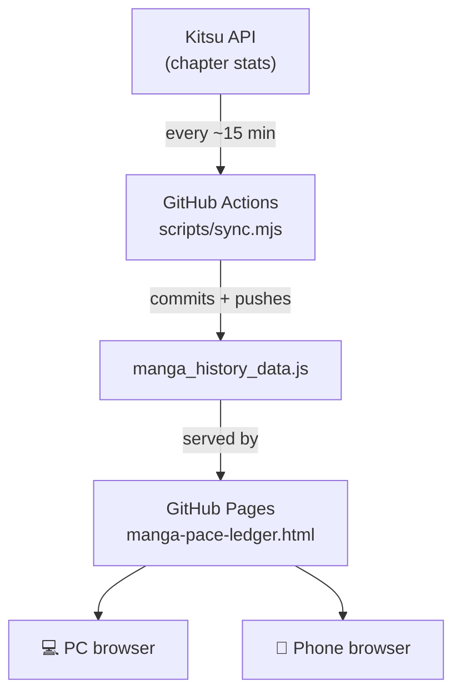

[README.md](https://github.com/user-attachments/files/29648574/README.md)
# 📖 Manga Pace Ledger

A self-updating dashboard that tracks manga chapters read (via [Kitsu](https://kitsu.io)), synced automatically in the cloud and viewable from any device — no PC required to be on.

**[→ View the live tracker](https://iky0ff.github.io/manga-pace-ledger/manga-pace-ledger.html)**

---

## How it works

A scheduled GitHub Actions workflow polls the Kitsu API on a cron, compares the result to the last recorded chapter count, and commits an update to `manga_history_data.js` if anything changed. GitHub Pages serves the dashboard straight from the repo, so opening the same URL on a laptop or a phone always shows current data — the sync runs on GitHub's servers, independent of whether any personal machine is online.

---

## Repo structure

| Path | Purpose |
|---|---|
| `manga-pace-ledger.html` | The dashboard — charts, streaks, goals, pace stats. Reads `manga_history_data.js` on load. |
| `manga_history_data.js` | The data file. An array of `{ date1, date2, chapters }` entries; overwritten in place by the sync. |
| `scripts/sync.mjs` | Node script that fetches Kitsu, parses the chapter count, and appends/updates an entry. |
| `.github/workflows/sync.yml` | Scheduled workflow that runs `sync.mjs` and commits the result. |
| `manga_history_data.bak` | Rolling backup — last version of the data file before the most recent write. |
| `manga_history_data_YYYYMMDD.bak.js` | One dated backup per day, refreshed on same-day reruns. |
| `sync_errors.log` | Timestamped log of failed fetches, parse errors, or skipped anomalies. Empty/absent when everything's healthy. |
| `fetch_manga_stats.vbs` | Original Windows script this was ported from. Kept as an optional local fallback — not required for the automated flow. |

---

## The sync logic

Each run:

1. Fetches `https://kitsu.io/api/edge/users/1699796/stats` with a cache-busting query param, retrying up to **3 times** on failure.
2. Locates the `manga-amount-consumed` stat and extracts its `units` value.
3. Compares it to the last recorded chapter count:
   - **Same value** → just refreshes the "last checked" timestamp on the final entry.
   - **Higher value, normal jump** → backs up the data file, then appends a new entry.
   - **Jump of 500+ chapters** → treated as a probable bad API response, not a real reading binge. Logged as an anomaly and **skipped** rather than written.
4. Commits and pushes only if the file actually changed — no empty commit spam.

---

## Setup

1. Push this repo to GitHub (public, so Pages + Actions minutes are free).
2. **Settings → Pages** → Source: `main` branch, `/ (root)` → Save. This gives you the public dashboard URL.
3. **Settings → Actions → General → Workflow permissions** → set to **Read and write permissions**, so the workflow is allowed to push commits.
4. **Actions tab → Sync Kitsu Manga Stats → Run workflow** to trigger a manual test run and confirm it commits successfully.
5. Sit back — it runs automatically from then on.

### Adjusting the schedule

The cron in `sync.yml` runs at `:07, :22, :37, :52` past every hour (offset from the crowd to dodge scheduling delays). Edit the `cron` line to change frequency — GitHub won't reliably run schedules more often than every ~5 minutes, and very short intervals increase the chance of overlapping/delayed runs.

### Adjusting the anomaly threshold

`ANOMALY_THRESHOLD` in `scripts/sync.mjs` (default `500`) controls how big a single jump in chapter count can be before it's flagged instead of trusted. Raise it if you binge-read in large batches; lower it if you want tighter guardrails.

---

## ⚠️ This is hardcoded to one Kitsu account

The Kitsu user ID `1699796` is baked directly into the URL in **two places** — anyone forking this repo needs to change both, or it'll keep syncing *my* chapter count, not yours:

| File | Line |
|---|---|
| `scripts/sync.mjs` | `const KITSU_URL = 'https://kitsu.io/api/edge/users/1699796/stats';` |
| `manga-pace-ledger.html` | inside `checkForUpdates()`: `fetch('https://kitsu.io/api/edge/users/1699796/stats?cachebuster=...')` |

**To point it at your own account:**

1. Find your Kitsu user ID — go to `https://kitsu.io/api/edge/users?filter[slug]=YOUR_USERNAME` in a browser (or check your profile URL/page source) and copy the numeric `id` field.
2. Replace `1699796` with that ID in both files above.
3. Since your reading history will start from zero, either let `manga_history_data.js` reinitialize on the next sync (delete its contents and start fresh — see note below) or manually seed it with your own historical data in the same `{ date1, date2, chapters }` format.

Note: `scripts/sync.mjs` will auto-create `manga_history_data.js` with a single starting entry if the file doesn't exist yet, so deleting it entirely before the first run on a new account works fine.

---

## Notes

- The dashboard's data file is loaded with a cache-busting timestamp (`manga_history_data.js?v=...`), so browsers — mobile ones especially — always pull the latest synced data instead of a stale cached copy.
- The `fetch_manga_stats.vbs` script and its Windows Task Scheduler job are no longer required once the GitHub Actions workflow is running, but can be kept as a manual/offline fallback.
